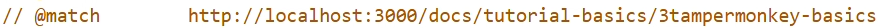

import ReactPlayer from 'react-player'
import MyVideoUrl from './static/tamper.png';
import MyThumbnailUrl from './static/tamper.png';

# Tampermonkey Basics
(From a Developer perspective)

## Making a new script
<ReactPlayer playing="true" controls url={MyVideoUrl} light={}/>
(Video not pushed yet since im on hotspot lmao)

## Breaking it down

Let's break this down starting with `@match`:
 
When we create a new script on our desired webpage, [**TamperMonkey**](https://tampermonkey.net) automatically matches it. The `@match` tag tells our userscript manager which webpage to run on. If we want our script to run on every webpage, we can use a few different methods. The one I like to use takes advantage of `@include`, like so:
```
// @include      http://*
// @include      https://*
```
This makes the script include every webpage that is `http` or `https` (Practically every internet site). 

However, it doesn't make the script run on local pages. A good example for beginners is a new tab. When you press `ctrl` + `t` in a browser like Chrome, it actually goes to `chrome://newtab`. You just don't realize is since it renders as blank. This is a local page since it can be accessed offline. If you go to the advanced tutorial later on, you'll see a much better example: `localhost:xxxx`. 
If we want our script to run really **EVERY** webpage, we can put
```
@match *://*/*
```

In some older versions of TamperMonkey, there was a bug where `@match *` would also work, however for obvious reasons we won't rely on a bug in this tutorial.

