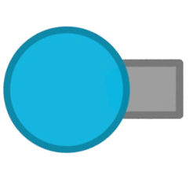
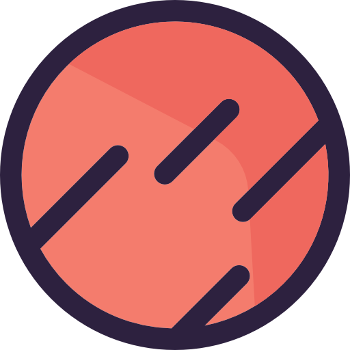

 <h1 style="margin: 0; padding: 0; transform: rotate(-10deg); display: inline-block;">
  Resume for <code>cat2d2</code> ,
</h1>
 
<h2 style="display: inline-block;">
  the <b>*best*</b> Puppeteer dev on Earth! 🌍
</h2> 

<i>(I'm not so sure about Mars anymore) </i>

_I'm an expert when it comes to canvas games and Puppeteer, however I know my way around other things aswell_ 
Client confidentiality is key for me!

Click [here](https://kit2d2.vercel.app) to go to a slightly outdated portfolio that lists all my skills and a few past projects. (Some new updates ruined the styling and I'm too lazy to remake)
See my [**Github**](https://github.com/cat2d2) portfolio for some of my popular projects. (13k forks what the sigma!?)

